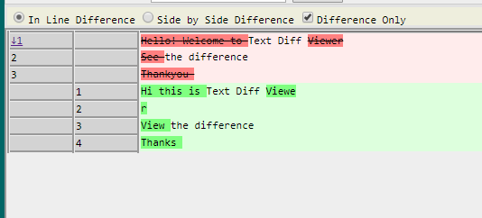
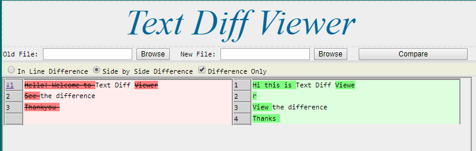
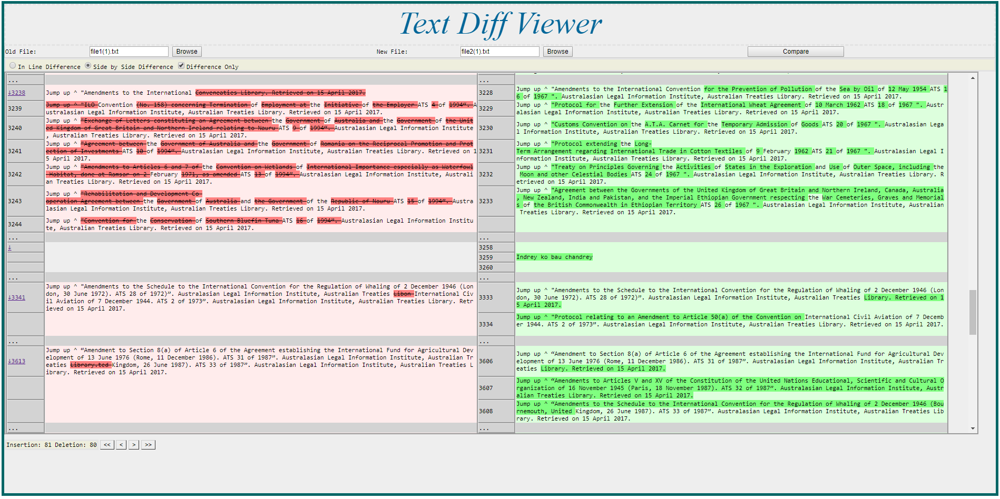

# Text-difference-viewer with Longest Common Subsequence and Shorted Middle snake
This project is a poc of Longest common subsequence and Shortest Middle Snake algorighm. (The divide and conquer methods to solve complex and time consuming computer problems)

# Credit
My sincere thanks and credit to http://www.mathertel.de
This project uses library from http://www.mathertel.de and implements it with furthur usability enhances.

# About project
The original library I started from could only find difference with in the limit of a sentence. 
I have modified the library a little to find and highlight the difference word wise.
I have developed the web application such that it allows us to upload two files and compare the texts inside them.
This project was completed by me during the final year of my university.
Working with this was really special because I could actually create a proof of concept for algorith we were learning in class.
Also, this was one of the first projects I did in C#.net. Thats why the Web forms ;) 

# Usability enhancement include
- Text file upload
- Inline and Side by side difference view
- Navigator to go directly to differences
- Collapse unchanged text portions
- Number of insertion and deletion
- Optimized with LCS and SMS algorithm to work with very large files

# Screenshots
- Inline view

- Side by side view

- Large text

Author
------
Prabesh KC
